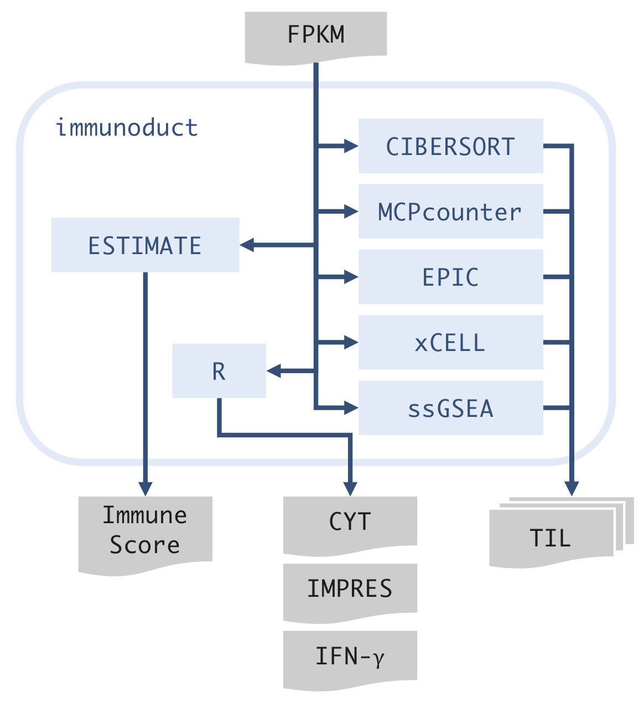
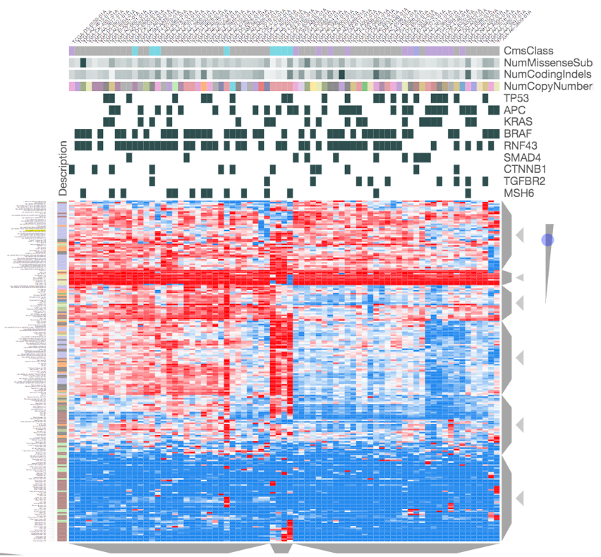

# immunoduct
Pipeline for tumor immunology. Input should be GCT files made by `riboduct`.



## Installation
### 1. Install conda
`immunoduct` requires `conda` package manager. To install `conda` for Linux,
```
wget https://repo.anaconda.com/miniconda/Miniconda3-latest-Linux-x86_64.sh
bash Miniconda3-latest-Linux-x86_64.sh
```

### 2. Install pipeline
Download and install `immunoduct`.
```
git clone https://github.com/msfuji/immunoduct.git
cd immunoduct
# activate conda
eval "$($HOME/miniconda3/bin/conda shell.bash hook)"
conda install mamba -c conda-forge
bash immunoduct.sh install
conda deactivate
```

### 3. Install R packages
Install required R packages. This will install `ESTIMATE`, `xCell`,
`EPIC`, and `MCPcounter` for immune profiling, along with others.
In SHIROKANE, you may use `/usr/local/package/r/3.6.0/bin/Rscript`.
```
Rscript scripts/install_r_packages.R
```

`CIBERSORT` is not automatically installed because of its license.
It should be noted that `immunoduct` runs without `CIBERSORT`.
If you still want to use `CIBERSORT`, you may go to
https://cibersort.stanford.edu/ and request R source code.
Download `CIBERSORT.R`, `LM22.txt`, and place them in `scripts/`.

## Usage
Make a local copy of pipeline for each project.
```
git clone https://github.com/msfuji/immunoduct.git
cd immunoduct
```
Modify `config.yaml`. Start running the pipeline.
```
eval "$($HOME/miniconda3/bin/conda shell.bash hook)"
conda activate immunoduct
bash immunoduct.sh run config.yaml
conda deactivate
conda deactivate
```
The output is saved to `output/immunoduct.gct`.

## Visualization (Optional)
```
eval "$($HOME/miniconda3/bin/conda shell.bash hook)"
conda activate immunoduct

# install clustergrammer (run only once)
pip install clustergrammer_widget
jupyter nbextension enable --py --sys-prefix widgetsnbextension
jupyter nbextension enable --py --sys-prefix clustergrammer_widget

bash immunoduct.sh view
conda deactivate
conda deactivate
```

